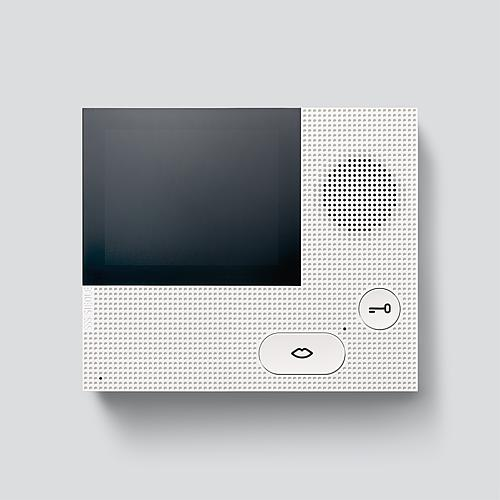

# VIB 150 interface
This repository contains information and code to interface with the SSS Siedle VIB-150 intercom device.
The device uses the proprietary Siedle "In-Home Bus".

The VIB 150 have three main connections:

* TaM, TbM - Proprietary In-Home bus monitor branch
* +M, -M   - Supply voltage 20-30 VDC
* ERT, ETb - Storey call button

## Passively reading data
Since the VIB-150 is directly connected to the Siedle In-Home bus I can piggyback on the data sent and received from it when interfacing with the bus.

This should let us learn more about the bus, as well as read door calls, audio and video as well as the required operations to actually interact with the device.

## Writing data

Writing data to the In-home bus requires us to bypass the VIB-150 altogether and pull the various connections with the correct resistors.

